<div align="center">

# 🚚 Delivery Platform

### Plateforme Complète de Gestion de Livraison

[](https://laravel.com)
[](https://livewire.laravel.com)
[](https://tailwindcss.com)
[](https://php.net)
[](https://mysql.com)

<br>

[](LICENSE)
[]()
[](http://makeapullrequest.com)

<br>


---

**Une solution tout-en-un pour la gestion de livraison avec suivi en temps réel, gestion des colis, livreurs, camions et dépôts.**

[🚀 Installation](#-installation-rapide) • [📚 Documentation](#-documentation) • [✨ Fonctionnalités](#-fonctionnalités-par-rôle) • [🏗️ Architecture](#️-architecture-du-système)

</div>

---

## 📑 Table des Matières

- [🌟 Aperçu](#-aperçu)
- [🏗️ Architecture du Système](#️-architecture-du-système)
- [📊 Modèle de Données](#-modèle-de-données)
- [✨ Fonctionnalités par Rôle](#-fonctionnalités-par-rôle)
- [🔄 Workflow des Colis](#-workflow-des-colis)
- [📜 Système d'Historique](#-système-dhistorique-complet)
- [� Système SMS](#-système-sms)
- [�🛠️ Stack Technique](#️-stack-technique)
- [🚀 Installation Rapide](#-installation-rapide)
- [📁 Structure du Projet](#-structure-du-projet)
- [🔐 Authentification & Sécurité](#-authentification--sécurité)
- [📱 Interface Responsive](#-interface-responsive)
- [🧪 Tests](#-tests)
- [📝 Commandes Utiles](#-commandes-utiles)
- [📚 Documentation](#-documentation)
- [🤝 Contribution](#-contribution)

---

## 🌟 Aperçu

```
┌─────────────────────────────────────────────────────────────────────┐
│                     🚚 DELIVERY PLATFORM                            │
├─────────────────────────────────────────────────────────────────────┤
│                                                                     │
│   👑 SUPER ADMIN          👔 ADMIN              👷 LIVREUR          │
│   ┌─────────────┐        ┌──────────────┐      ┌─────────────┐     │
│   │ • Tous les  │        │ • Gestion    │      │ • Interface │     │
│   │   dépôts    │        │   dépôt      │      │   mobile    │     │
│   │ • Admins    │        │ • Colis      │      │ • Scan QR   │     │
│   │ • Stats     │        │ • Livreurs   │      │ • Photos    │     │
│   │ • Historiq. │        │ • Camions    │      │ • GPS       │     │
│   └─────────────┘        └──────────────┘      └─────────────┘     │
│                                                                     │
│   📦 Colis ──→ 🏪 Dépôts ──→ 🚛 Camions ──→ 📍 Livraison          │
│                                                                     │
└─────────────────────────────────────────────────────────────────────┘
```

### 🎯 Points Clés

| Fonctionnalité | Description |
|:---:|:---|
| 📦 **Gestion Colis** | Création, suivi, QR Code automatique, photos de livraison |
| 🚛 **Gestion Flotte** | Camions, assignations, historique d'utilisation |
| 👷 **Gestion Livreurs** | Performances, tournées, statistiques détaillées |
| 🏪 **Multi-Dépôts** | Architecture multi-sites avec transferts inter-dépôts |
| 📊 **Historique Complet** | Traçabilité totale de chaque colis et livreur |
| � **SMS Automatique** | Notifications SMS en arabe tunisien (TextFlow/Infobip) |
| 🌍 **Codes Pays** | Sélecteur de code téléphonique avec 70+ pays et recherche |
| �📱 **Mobile-First** | Interface optimisée pour livreurs sur le terrain |

---

## 🏗️ Architecture du Système

### Vue d'Ensemble

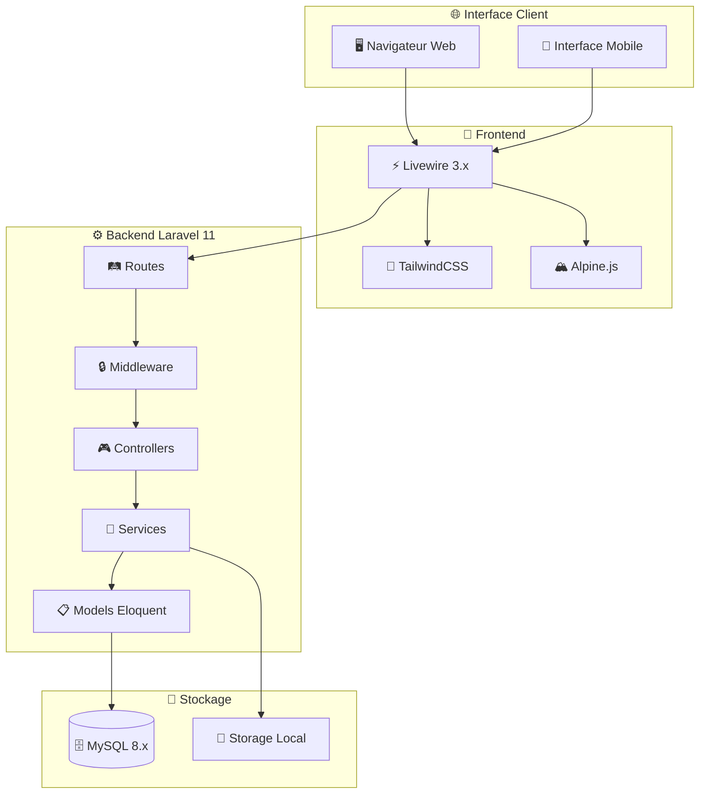

### Architecture des Rôles

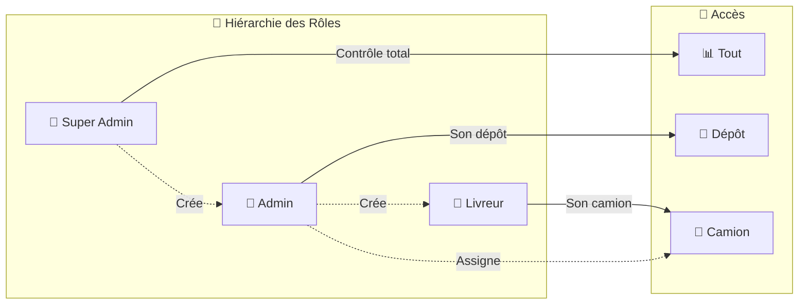

---

## 📊 Modèle de Données

### Diagramme Entité-Relation Complet

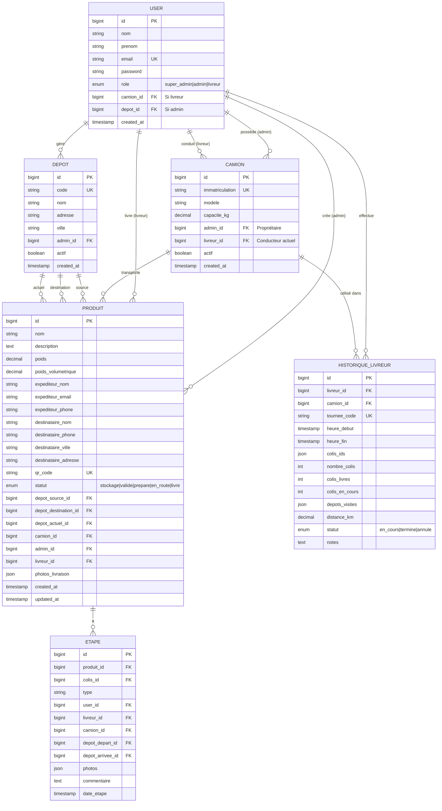

### Relations Clés

| Relation | Type | Description |
|:---|:---:|:---|
| 👤 User → 📦 Produit | 1:N | Un admin crée plusieurs produits |
| 👤 User → 🚛 Camion | 1:N | Un admin possède plusieurs camions |
| 👷 Livreur → 🚛 Camion | 1:1 | Un livreur conduit un camion |
| 🚛 Camion → 📦 Produit | 1:N | Un camion transporte plusieurs produits |
| 🏪 Depot → 📦 Produit | 1:N | Plusieurs produits par dépôt |
| 👷 Livreur → 📜 Historique | 1:N | Un livreur a plusieurs tournées |
| 📦 Produit → 📍 Etape | 1:N | Traçabilité complète |

---

## ✨ Fonctionnalités par Rôle

### 👑 Super Admin

| Fonctionnalité | Description |
|:---|:---|
| 📊 **Dashboard Global** | KPIs en temps réel, revenus et statistiques |
| 🏪 **Gestion Multi-Dépôts** | Créer, modifier, activer/désactiver |
| 👔 **Gestion des Admins** | Créer des comptes et assigner aux dépôts |
| 📜 **Historique Complet** | Par Livreur et par Camion avec filtres avancés |
| 📈 **Statistiques** | Performance par admin et par livreur |

### 👔 Admin (Gestionnaire de Dépôt)

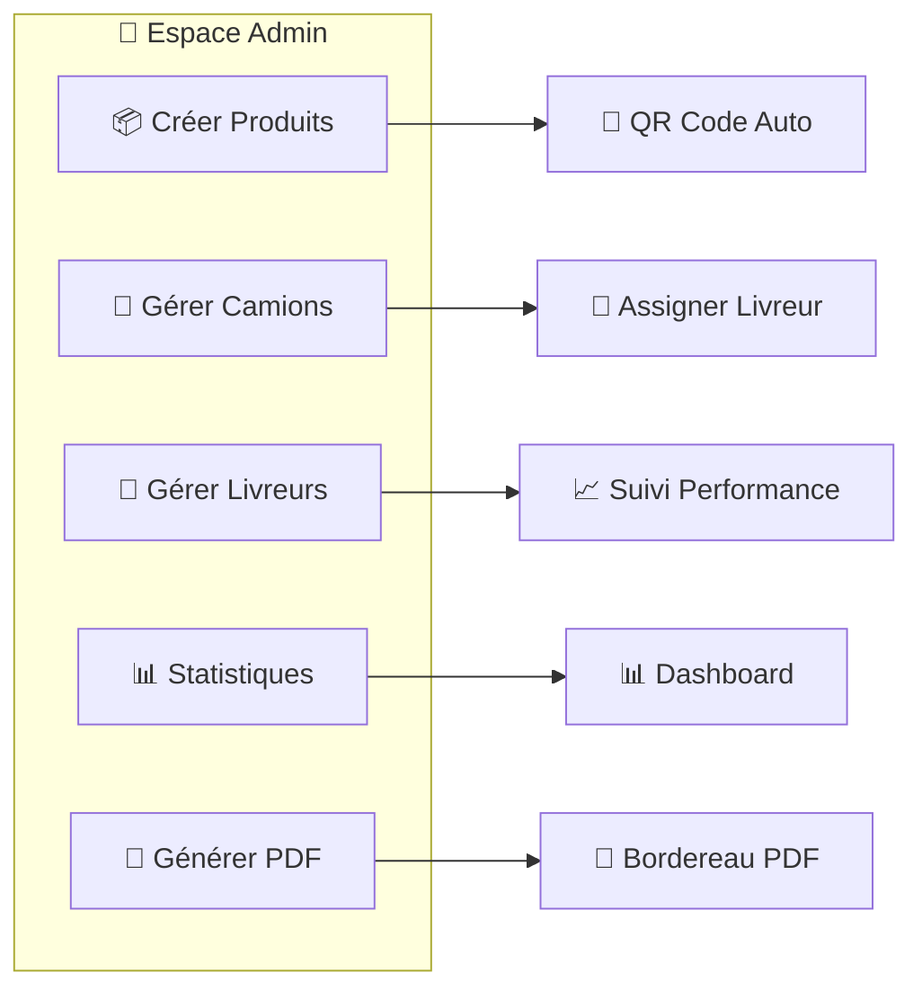

| Fonctionnalité | Description | Icône |
|:---|:---|:---:|
| **Gestion Produits** | CRUD complet avec génération QR Code automatique | 📦 |
| **Gestion Camions** | Création et assignation aux livreurs | 🚛 |
| **Gestion Livreurs** | Création de comptes et suivi de performance | 👷 |
| **Bordereaux PDF** | Génération avec QR Code intégré | 📄 |
| **Suivi Livraisons** | Temps réel avec statuts | 📍 |

### 👷 Livreur

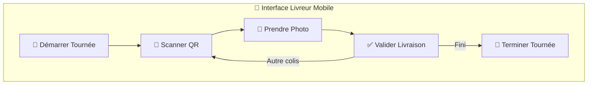

| Action | Description |
|:---:|:---|
| 📱 **Scan QR** | Validation rapide des colis par scan |
| 📸 **Photo** | Preuve de livraison obligatoire |
| 📍 **GPS** | Localisation automatique à la livraison |
| 📊 **Stats** | Visualisation des performances personnelles |
| 📜 **Historique** | Consultation des tournées passées |

---

## 🔄 Workflow des Colis

### Cycle de Vie Complet

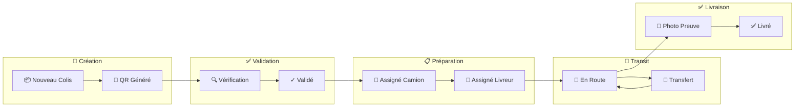

### Statuts des Colis

| Statut | Couleur | Description | Action Suivante |
|:---|:---:|:---|:---|
| `stockage` | ⬜ Gris | Colis créé, en attente | Validation par admin |
| `valide` | 🟦 Bleu | Validé par admin | Préparation |
| `prepare` | 🟨 Jaune | Prêt pour livraison | Prise en charge |
| `en_route` | 🟧 Orange | En cours de livraison | Livraison ou transfert |
| `livre` | 🟩 Vert | Livré au destinataire | Archivage |

---

## 📜 Système d'Historique Complet

### Historique par Livreur

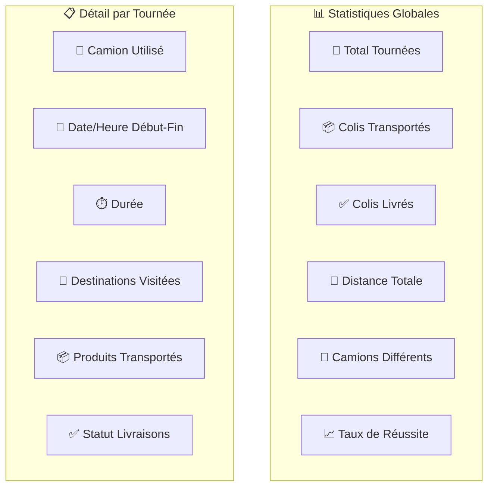

### Historique par Camion

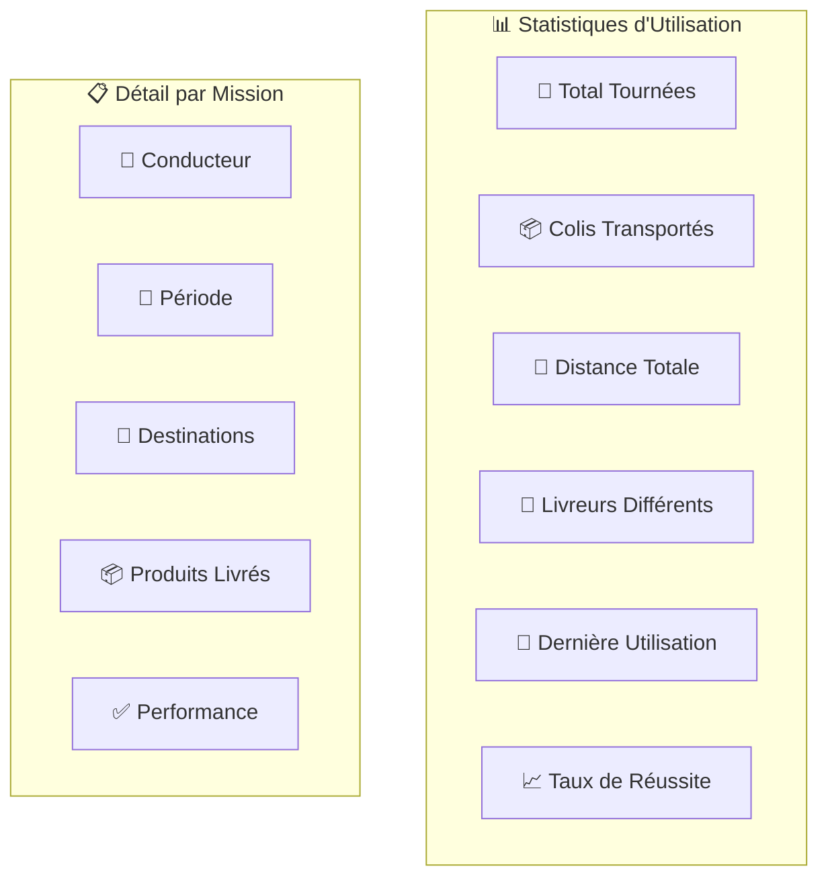

### Comment l'Historique est Créé

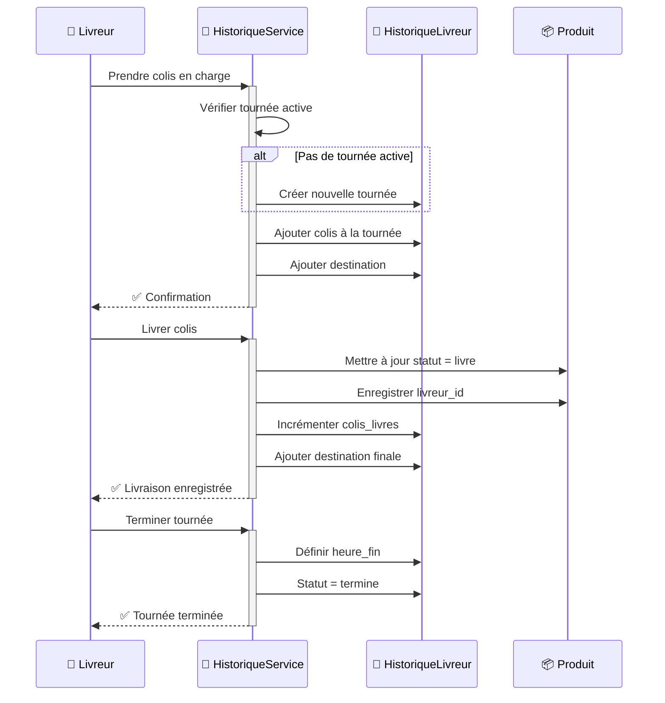

### Routes de l'Historique

| Route | Composant | Description |
|:---|:---|:---|
| `/super-admin/livreur/{id}/history` | `HistoireLivreur` | Historique complet d'un livreur |
| `/super-admin/camion/{id}/history` | `HistoireCamion` | Historique complet d'un camion |

---

## � Système SMS

### Notifications SMS Automatiques

Le système envoie des SMS automatiques en **arabe tunisien (darija)** à l'expéditeur et au destinataire lors de la création d'un colis.

#### Fournisseurs SMS Supportés

| Fournisseur | Statut | API Endpoint |
|:---:|:---:|:---|
| **TextFlow** | ✅ Actif | `https://textflow.me/api/send-sms` |
| **Infobip** | ⚙️ Configuré | `https://{base}.api.infobip.com` |
| **Twilio** | 📦 Disponible | Via SDK Twilio |
| **Vonage** | 📦 Disponible | Via SDK Vonage |
| **Orange TN** | 📦 Disponible | API Orange Tunisie |

#### Messages SMS en Arabe Tunisien

**📤 SMS Expéditeur:**
```
مرحبا {nom}! الكولي متاعك ({produit}) تسجلت في المنصة.
رقم التتبع: {qr_code}
تنجم تتبع الكولي من هنا: {tracking_url}
```

**📥 SMS Destinataire:**
```
مرحبا {nom}! عندك كولي جاي ليك ({produit}).
رقم التتبع: {qr_code}
تنجم تتبع الكولي من هنا: {tracking_url}
```

#### Sélecteur de Code Pays

Interface **Alpine.js** avec recherche et défilement pour la sélection du code téléphonique :

- 🔍 **Recherche** par nom de pays ou code
- 🏳️ **Drapeaux** emoji pour chaque pays
- 📜 **70+ pays** supportés
- 📱 **Présent dans** : Création colis, Création produit, Détail produit

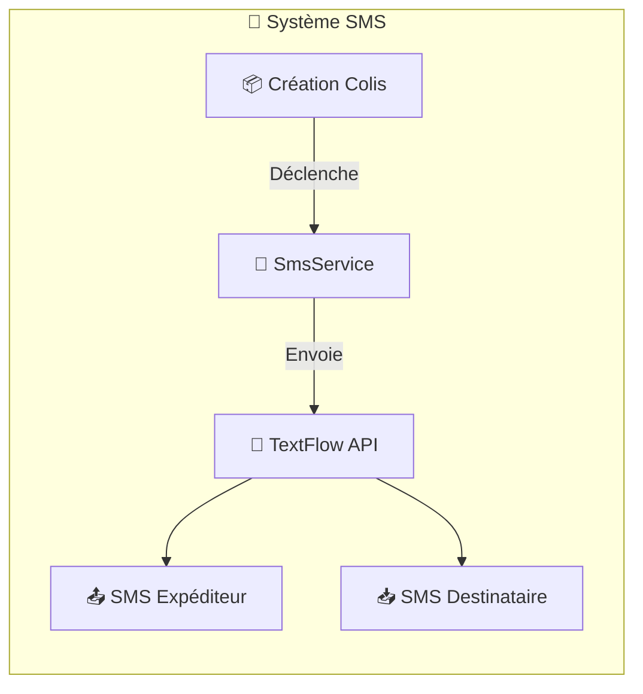

#### Configuration SMS (`.env`)

```env
# Fournisseur SMS actif
SMS_PROVIDER=textflow

# TextFlow
TEXTFLOW_API_KEY=votre_cle_api_textflow

# Infobip (alternative)
INFOBIP_API_KEY=votre_cle_api_infobip
INFOBIP_BASE_URL=xxxxx.api.infobip.com
INFOBIP_SENDER=DeliveryPlatform
```

> **Note:** Les appels SMS sont actuellement commentés dans le code pour la phase de développement. Décommentez `$this->sendTrackingSms()` dans `ColisManagement.php` et `CreateProduit.php` pour activer.

---

## �🛠️ Stack Technique

### Technologies Principales

| Catégorie | Technologie | Version | Rôle |
|:---:|:---:|:---:|:---|
| **Backend** | Laravel | 11.x | Framework PHP principal |
| **Frontend** | Livewire | 3.x | Composants réactifs |
| **CSS** | TailwindCSS | 3.x | Framework CSS utility-first |
| **Database** | MySQL | 8.x | Base de données relationnelle |
| **JS** | Alpine.js | 3.x | Interactivité légère |
| **Build** | Vite | 5.x | Build tool rapide |

### Packages Clés

| Package | Usage |
|:---|:---|
| `simplesoftwareio/simple-qrcode` | Génération QR Code |
| `barryvdh/laravel-dompdf` | Génération PDF |
| `Laravel Breeze` | Authentification |
| `TextFlow API` | Envoi SMS (arabe tunisien) |
| `Alpine.js` | Sélecteur code pays interactif |

---

## 🚀 Installation Rapide

### Prérequis

| Logiciel | Version Minimum |
|:---|:---:|
| 🐘 PHP | ≥ 8.2 |
| 📦 Composer | ≥ 2.0 |
| 📗 Node.js | ≥ 18 |
| 🗄️ MySQL | ≥ 8.0 |

### Installation en 5 Minutes

```bash
# 1️⃣ Cloner le projet
git clone https://github.com/votre-username/delivery-platform.git
cd delivery-platform

# 2️⃣ Installer les dépendances
composer install
npm install

# 3️⃣ Configuration
cp .env.example .env
php artisan key:generate

# 4️⃣ Base de données (modifier .env d'abord)
php artisan migrate
php artisan db:seed  # Optionnel: données de test

# 5️⃣ Lancer l'application
php artisan serve     # Terminal 1: Backend
npm run dev           # Terminal 2: Frontend
```

### Configuration `.env`

```env
# 🗄️ Base de données
DB_CONNECTION=mysql
DB_HOST=127.0.0.1
DB_PORT=3306
DB_DATABASE=delivery_platform
DB_USERNAME=root
DB_PASSWORD=

# 📲 SMS (TextFlow)
SMS_PROVIDER=textflow
TEXTFLOW_API_KEY=votre_cle_api

# 📲 SMS (Infobip - alternative)
INFOBIP_API_KEY=votre_cle_api
INFOBIP_BASE_URL=xxxxx.api.infobip.com
INFOBIP_SENDER=DeliveryPlatform
```

### Comptes de Test par Défaut

| Rôle | Email | Mot de passe |
|:---:|:---|:---:|
| 👑 Super Admin | `superadmin@delivery.com` | `password` |
| 👔 Admin | `admin@delivery.com` | `password` |
| 👷 Livreur | `livreur1@delivery.com` | `password` |

---

## 📁 Structure du Projet

```
delivery-platform/
│
├── 📂 app/
│   ├── 📂 Console/Commands/        # Commandes Artisan personnalisées
│   │   ├── GenerateHistoryTestData.php
│   │   └── ReconstruireHistorique.php
│   │
│   ├── 📂 Http/
│   │   ├── Controllers/            # Contrôleurs HTTP
│   │   └── Middleware/             # Middleware personnalisés
│   │
│   ├── 📂 Livewire/                # Composants Livewire
│   │   ├── Admin/                  # 👔 Composants Admin
│   │   │   ├── SuperAdminDashboard.php
│   │   │   ├── ColisManagement.php
│   │   │   ├── HistoireLivreur.php
│   │   │   └── HistoireCamion.php
│   │   ├── Livreur/                # 👷 Composants Livreur
│   │   │   ├── LivraisonManagement.php
│   │   │   └── ProduitDetails.php
│   │   └── Forms/                  # 📝 Formulaires
│   │
│   ├── 📂 Models/                  # 📋 Modèles Eloquent
│   │   ├── User.php
│   │   ├── Produit.php
│   │   ├── Colis.php
│   │   ├── Camion.php
│   │   ├── Depot.php
│   │   ├── HistoriqueLivreur.php
│   │   └── Etape.php
│   │
│   └── 📂 Services/                # 🔧 Services
│       ├── HistoriqueService.php   # Gestion automatique des historiques
│       └── SmsService.php          # Envoi SMS multi-fournisseur (TextFlow, Infobip, etc.)
│
├── 📂 database/
│   ├── migrations/                 # 📊 Migrations
│   └── seeders/                    # 🌱 Seeders
│
├── 📂 resources/
│   ├── views/
│   │   ├── livewire/               # 🎨 Vues Livewire
│   │   └── layouts/                # 📐 Layouts
│   └── css/                        # 🎨 Styles
│
├── 📂 routes/
│   ├── web.php                     # 🛤️ Routes web
│   └── auth.php                    # 🔐 Routes auth
│
└── 📂 tests/                       # 🧪 Tests
    ├── Feature/
    └── Unit/
```

---

## 🔐 Authentification & Sécurité

### Système d'Authentification

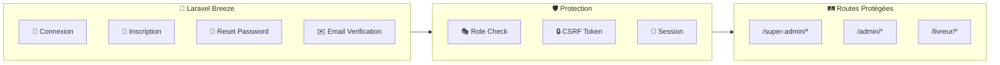

### Contrôle d'Accès par Rôle

| Route Pattern | Rôle Requis | Middleware |
|:---|:---:|:---|
| `/super-admin/*` | `super_admin` | `auth`, `role:super_admin` |
| `/admin/*` | `admin` | `auth`, `role:admin` |
| `/livreur/*` | `livreur` | `auth`, `role:livreur` |
| `/tracking/*` | Public | Aucun |

---

## 📱 Interface Responsive

| Device | Optimisation | Cible |
|:---:|:---|:---|
| 📱 **Mobile** | Interface tactile, scan QR, photos | 👷 Livreurs |
| 📲 **Tablette** | Dashboard adapté, navigation fluide | 👔 Admins |
| 🖥️ **Desktop** | Vue complète, statistiques détaillées | 👑 Super Admin |

---

## 🧪 Tests

```bash
# Lancer tous les tests
php artisan test

# Tests avec couverture
php artisan test --coverage

# Tests spécifiques
php artisan test --filter=ColisTest

# Tests en parallèle
php artisan test --parallel
```

---

## 📝 Commandes Utiles

### Commandes Laravel

```bash
# 🔄 Vider les caches
php artisan cache:clear
php artisan view:clear
php artisan config:clear
php artisan route:clear

# 📊 Base de données
php artisan migrate:fresh --seed    # Reset complet
php artisan db:seed                  # Données de test

# 📋 Voir les routes
php artisan route:list

# 🔧 Régénérer
composer dump-autoload
```

### Commandes Personnalisées

```bash
# 📜 Générer des données d'historique de test
php artisan history:generate-test-data

# 🔄 Reconstruire l'historique depuis les livraisons existantes
php artisan history:rebuild
```

---

## 📚 Documentation

| Document | Description | Lien |
|:---:|:---|:---:|
| 📜 **Guide Historique** | Documentation technique complète du système d'historique | [HISTORIQUE_IMPLEMENTATION.md](HISTORIQUE_IMPLEMENTATION.md) |
| ⚡ **Guide Rapide** | Utilisation rapide du système d'historique | [HISTORIQUE_GUIDE_RAPIDE.md](HISTORIQUE_GUIDE_RAPIDE.md) |
| 🔍 **Dépannage** | Résolution des problèmes d'historique vide | [HISTORIQUE_POURQUOI_VIDE.md](HISTORIQUE_POURQUOI_VIDE.md) |
| 📦 **Guide Colis** | Documentation du système de colis | [COLIS_SYSTEM_GUIDE.md](COLIS_SYSTEM_GUIDE.md) |
| 🧪 **Guide Tests** | Comment tester l'application | [TESTING_GUIDE.md](TESTING_GUIDE.md) |

---

## 🤝 Contribution

### Comment Contribuer

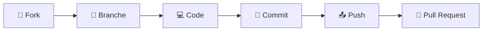

### Étapes

1. 🍴 **Fork** le projet
2. 🌿 **Créer** une branche (`git checkout -b feature/ma-fonctionnalite`)
3. 💻 **Coder** votre fonctionnalité
4. ✅ **Tester** votre code (`php artisan test`)
5. 💾 **Commit** (`git commit -m 'Ajout: Ma fonctionnalité'`)
6. 📤 **Push** (`git push origin feature/ma-fonctionnalite`)
7. 🔀 **Ouvrir** une Pull Request

### Conventions de Commit

| Préfixe | Description |
|:---:|:---|
| `Ajout:` | Nouvelle fonctionnalité |
| `Fix:` | Correction de bug |
| `Docs:` | Documentation |
| `Style:` | Formatage (pas de changement de code) |
| `Refactor:` | Refactorisation |
| `Test:` | Ajout de tests |
| `Chore:` | Maintenance |

---

## 📄 License

Ce projet est sous licence **MIT**. Voir le fichier [LICENSE](LICENSE) pour plus de détails.

---

<div align="center">

## 📸 Captures d'Écran

### Dashboard Super Admin


### Interface Livreur


### Gestion des Colis


---

<br>

### 🚚 Delivery Platform

**Simplifiez votre logistique de livraison**

<br>

Made with ❤️ in Tunisia 🇹🇳

<br>

⭐ **Star ce repo si vous trouvez ce projet utile !** ⭐

</div>
