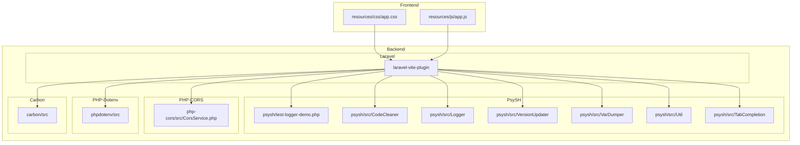

    

    <b>Automatic Architecture Diagrams from Code</b> 
    <a href="https://github.com/swark-io/swark">GitHub</a> • <a href="https://swark.io">Website</a> • <a href="mailto:contact@swark.io">Contact Us</a>

## Usage Instructions

1. **Render the Diagram**: Use the links below to open it in Mermaid Live Editor, or install the [Mermaid Support](https://marketplace.visualstudio.com/items?itemName=bierner.markdown-mermaid) extension.
2. **Recommended Model**: If available for you, use `claude-3.5-sonnet` [language model](vscode://settings/swark.languageModel). It can process more files and generates better diagrams.
3. **Iterate for Best Results**: Language models are non-deterministic. Generate the diagram multiple times and choose the best result.

## Generated Content
**Model**: GPT-4o - [Change Model](vscode://settings/swark.languageModel)  
**Mermaid Live Editor**: [View](https://mermaid.live/view#pako:eNqNk8FOwzAMhl-lyplu9x2QtpYx2BATG1xaDllq2kKaRE4yaZp4d7IWmFsQwpfqtz99lqz0yIQugE1Yrkrkpoq2aa6iUNbvusYctXKgiq59qmmGYLVHAXYsrB1zY0bh-3wmZoR47YDXr3mrGuyYcfHWW_E9WXHke5DnyamSTHbteF87iI30Za3IerKiJ1vbw2bRV6WZsQdbjR1YF0tdloBxAY0emco899GrT9SiGCfhaIkErgAH1JxQq9Y3AK4J8ARoa60eTcHdD3BBQY6pb8wP5oYwj66Wg_EtGW_5LtGNkeDCxv8ca7GOk_uHTd-4zMJhYqHRft4B7QZwXwsYXOwvbarDg9r3xauTuGgHJ_M_TAnHnVZ9y10m2u5vioFrGsXxZZR0YUZD0oaUhisa5jRc07Cg4YaGWxqWNKxouMsVu2ANYMPrIvyVx5y5ChrI2STKWQEv3EuXs_cA-fbRpDUP12jYxKGHC8a905uDEl8ZtS8rNnnh0sL7B0TqIj0) | [Edit](https://mermaid.live/edit#pako:eNqNk8FOwzAMhl-lyplu9x2QtpYx2BATG1xaDllq2kKaRE4yaZp4d7IWmFsQwpfqtz99lqz0yIQugE1Yrkrkpoq2aa6iUNbvusYctXKgiq59qmmGYLVHAXYsrB1zY0bh-3wmZoR47YDXr3mrGuyYcfHWW_E9WXHke5DnyamSTHbteF87iI30Za3IerKiJ1vbw2bRV6WZsQdbjR1YF0tdloBxAY0emco899GrT9SiGCfhaIkErgAH1JxQq9Y3AK4J8ARoa60eTcHdD3BBQY6pb8wP5oYwj66Wg_EtGW_5LtGNkeDCxv8ca7GOk_uHTd-4zMJhYqHRft4B7QZwXwsYXOwvbarDg9r3xauTuGgHJ_M_TAnHnVZ9y10m2u5vioFrGsXxZZR0YUZD0oaUhisa5jRc07Cg4YaGWxqWNKxouMsVu2ANYMPrIvyVx5y5ChrI2STKWQEv3EuXs_cA-fbRpDUP12jYxKGHC8a905uDEl8ZtS8rNnnh0sL7B0TqIj0)

