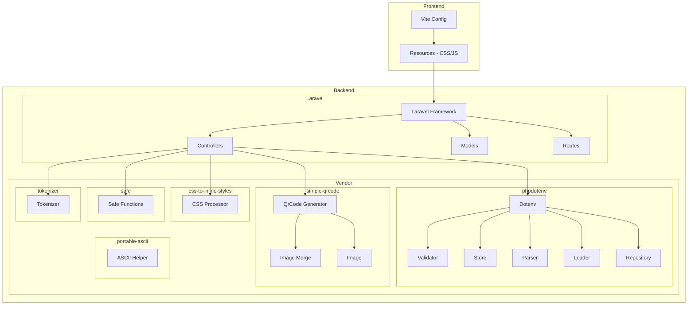

    

    <b>Automatic Architecture Diagrams from Code</b> 
    <a href="https://github.com/JashanMaan28/swark-continued">GitHub (Fork)</a> • <a href="https://github.com/swark-io/swark">Original Project</a>

## Usage Instructions

1. **Render the Diagram**: Use the links below to open it in Mermaid Live Editor, or install the [Mermaid Support](https://marketplace.visualstudio.com/items?itemName=bierner.markdown-mermaid) extension.
2. **Recommended Model**: If available for you, use `gemini` [language model](vscode://settings/swark-continued.languageModel). It can process more files and generates better diagrams.
3. **Iterate for Best Results**: Language models are non-deterministic. Generate the diagram multiple times and choose the best result.

## Generated Content
**Model**: GPT-4o - [Change Model](vscode://settings/swark-continued.languageModel)  
**Mermaid Live Editor**: [View](https://mermaid.live/view#pako:eNqVlE1vozAQhv-K5XNR7zmslEDz1dAmocrF5ODChFg1Nh2brrJV__s60A8T2JXi2zMPfplxTN5ppnOgI5qqAnl1JE9Rqohbpn5uC1PUyoLK2_J5jdlOWCChVgdR7H_qE7YFo2vMwJCAhElyu0w-dbP_InjCs5dO7rdZceRvIH_MeYXss-w64iX81viy7z4RMdeSRS0loLlwdyx2c8rL8pRtdW3BL3utdpraOaGxu_1bVscq1-6U3rr-vGYsasy-r-Zsx6XIudU4YBcscQIGzJKtORoY2nTPVprng2rlfp5KG-FCTxf6YubOaEaUlYTgFc8XpZ8asw2GzpAZKMB_jPLAFiUvgMSAxdBAj62_oqtKo-XPri9uMiH6iWs2TsLFgsxBVr3T-F9wZkxgdSCUFAoCY08STD9-w9z1JmvU7q4bfU2-4YeBU9yyxNXJtFaZFVqZKwKtdl-R-APYT03Y05ccCuyB95oxCYJfZNLCpIGwhbCByIc7H6YtRA3MfIh92Piw9SFpYdbA3IeFD0sf7n1YtRA38ODDY6roDS0BSy5y96f3nlJ7hBJSOiIpzeHAa2lT-uEeqiv3XUIkuDvlko4s1nBDeW11clLZF6OuiyMdHbg08PEX0vlk4Q) | [Edit](https://mermaid.live/edit#pako:eNqVlE1vozAQhv-K5XNR7zmslEDz1dAmocrF5ODChFg1Nh2brrJV__s60A8T2JXi2zMPfplxTN5ppnOgI5qqAnl1JE9Rqohbpn5uC1PUyoLK2_J5jdlOWCChVgdR7H_qE7YFo2vMwJCAhElyu0w-dbP_InjCs5dO7rdZceRvIH_MeYXss-w64iX81viy7z4RMdeSRS0loLlwdyx2c8rL8pRtdW3BL3utdpraOaGxu_1bVscq1-6U3rr-vGYsasy-r-Zsx6XIudU4YBcscQIGzJKtORoY2nTPVprng2rlfp5KG-FCTxf6YubOaEaUlYTgFc8XpZ8asw2GzpAZKMB_jPLAFiUvgMSAxdBAj62_oqtKo-XPri9uMiH6iWs2TsLFgsxBVr3T-F9wZkxgdSCUFAoCY08STD9-w9z1JmvU7q4bfU2-4YeBU9yyxNXJtFaZFVqZKwKtdl-R-APYT03Y05ccCuyB95oxCYJfZNLCpIGwhbCByIc7H6YtRA3MfIh92Piw9SFpYdbA3IeFD0sf7n1YtRA38ODDY6roDS0BSy5y96f3nlJ7hBJSOiIpzeHAa2lT-uEeqiv3XUIkuDvlko4s1nBDeW11clLZF6OuiyMdHbg08PEX0vlk4Q)

